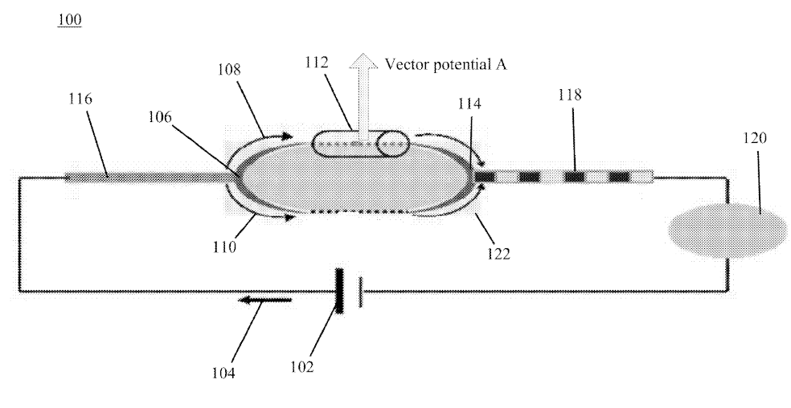

# aharonov-bohm-non-invasive-brain-computer-interface
Code and Documents to build out a non-invasive brain computer interface using the Aharnov-Bohm Effect. This is work and research is a product of my personal search for relief from Autism Spectrum Disorder ("Asperger's Syndrome"), which I experience from severe symptoms of complete overload of my sensory inputs to mild EM sensitivity (sensing Crystals, Lidar, EM Fields, etc). I was looking for a way to deal with the my medical condition, through which I found that using <a href="https://github.com/autonomous019/ahronov-bohm-cybersecurity">pulsed modulated LED and EM signals</a> provided relief. In my research for that I wrote a book, "Battlespace of Mind: AI, Cybernetics and Information Warfare" (Trineday, 2024). This led me to insights into using the AB Effect for a Brain Computer Interface. The AB sensor patent claims are that one can read out brain states using the AB Effect, which also impacted my Autistic condition: subtle potential energies bubbling up into interfering with my sensory inputs on the classical level from the quantum potential level. The sensor was patented in 2013, but initiated in 2011. However, unfortunately, the author and researcher on this, <a href="https://www.pa.ucla.edu/moossa-j-arman-colloquium.html">Moe J. Arman</a>, died just after applying for the patent in 2012 through his work at Lockheed-Martin and the Air Force Research Laboratory, all of his work there is classified, except the public patent to protect IP of Lockheed-Martin. So no work has been done, at least anywhere in the public, on this sensor, I am seeking to continue Arman's work through this endeavor here. It should also be mentioned that this work understanding of the AB Effect is based on Berry Phase and the geometric understanding of the AB Effect. 

<b>click on book cover to download <a href="https://drive.google.com/file/d/142VRVDXCo5R4R3C4MQXszDbXOZo4y2Vm/view?usp=sharing">free eBook PDF</a></b>

<h2>BCI Synopsis:</h2>

<blockquote>We propose a novel brain–computer interface (BCI) architecture leveraging the quantum Aharonov–
Bohm (AB) effect to achieve non-contact neural sensing and stimulation. Theoretical foundations of the
AB effect in the Standard Model are reviewed, emphasizing how electromagnetic vector potentials (𝐀-
fields) can induce phase shifts in charged particles without local fields, enabling phase-based quantum
sensing. We explain how an AB-based sensor can detect cortical electromagnetic activity remotely by
measuring phase shifts induced by the brain’s vector potential, with no direct energy exchange .
The AB sensor design by Chase et al. (Lockheed Martin) is analyzed in depth: an electron interferometer
with a field-free enclosure that registers minuscule phase modulations due to ambient potentials .
We detail the sensor’s architecture, signal path, detection principle, and fundamental sensitivity limits,
noting that a potential of order 1 nV can produce a π/2 phase shift in microseconds – six orders of
magnitude more sensitivity than classical electromagnetic sensors (10^6 or 1 million times more resolution) . A complete hardware blueprint
for an AB-BCI system is presented, integrating quantum sensor tiles (e.g. Rydberg atom electrometers,
nitrogen-vacancy diamond magnetometers, optically pumped magnetometers) for multi-modal field
detection, AB-driven 𝐀-field shaping arrays for stealth neuromodulation, control electronics, and safety
interlocks. We develop a signal processing model comprising quantum interference demodulation,
source current inversion, adaptive filtering, phase-coherence analysis, and closed-loop stimulation
scheduling. Defense and national security implications are discussed, including stealth neural
monitoring (covert mind-reading at distance), battlefield cognitive augmentation for warfighters,
operator–vehicle neural coupling, and cybersecurity of neuro-quantum channels. Dual-use
opportunities in medicine and human performance are outlined alongside a technology maturation
roadmap. Results from theoretical modeling and prior art are presented to validate the feasibility: the
AB sensor’s phase response scales with source potential and inversely with distance , offering high
SNR detection of neural signals without disturbing them . We conclude that an AB-effect BCI
could fundamentally surpass traditional EEG/MEG in sensitivity and stealth, though significant
engineering challenges remain in coherence maintenance, integration, and ethical deployment</blockquote>

---

## Table of Contents
- <a href="#sensor">The Aharonov–Bohm Sensor Patent</a>
- <a hre="#bci">The Aharonov-Bohm Brain Computer Interface</a>

## 
AB Sensor

<h1>Lockheed Martin Patent that proposes reading brain neurons and mapping brain state via the AB Effect</h1>

## "Utilizing AB sensor 100, innermost electronics signals may be sensed from well protected hardware, which may be hundreds of miles away. Furthermore, AB sensor 100 may be so sensitive that it can detect waves emanating from a human's nerve system. Thus, a person’s mind may be read without the person realizing it. Based on the direction and strength of a signal, distribution of currents (e.g., thoughts) in the brain can be mapped out" pg. 10, line 49-54 of Patent US 8,389,948 B2

<a href="__Aharonov–Bohm Effect Based Brain–Computer Interface for Defense Applications__.pdf">Proposal for a Brain Computer Interface based on AB Sensor, non-invasive and non-contact neural sensing</a>

# README — Lockheed Martin <a href="https://patentimages.storage.googleapis.com/fe/bb/78/e632d33e77d742/US8389948.pdf">“Aharonov–Bohm Sensor” (US 8,389,948 B2) </a>

**Inventors:** Moe J. Arman & Charles J. Chase  
**Assignee:** Lockheed Martin Corporation  
**Grant Date:** 2013-03-05  
**Patent Title:** *Aharonov–Bohm Sensor*  
**Patent Type:** Quantum interferometric magnetic-potential detector

---

## 1  Overview

The Aharonov–Bohm (AB) Sensor is a **quantum-interference-based field detector** designed to measure changes in **magnetic vector potential A** rather than the classical magnetic field B.  
Whereas conventional magnetometers rely on the Lorentz force (q v × B) on moving charges, this device measures **phase shifts in an electron interferometer** caused by enclosed magnetic flux even when the local magnetic field is zero.

In effect, it is a *quantum phase voltmeter* for A:  
 Δφ = (e/ħ) ∮ A·dl

The system isolates a field-free region (B ≈ 0) but encloses magnetic flux elsewhere, allowing the **Aharonov–Bohm phase** to modulate the interference of split electron wavefunctions. That phase shift becomes the sensed signal.

---

## 2  Functional Architecture

### 2.1  Core Elements

1. **Electron Source**
   - Thermionic or field-emission gun producing a coherent, mono-energetic electron beam.
   - Energy spread narrow enough to maintain path-length coherence (ΔE/E ≪ 10⁻⁴).

2. **Beam Splitter / Interferometer**
   - Electron beam is split into two coherent paths (Mach–Zehnder, ring, or double-slit geometry).
   - One arm passes through a *shielded cage* enclosing a confined magnetic flux; the other passes through a reference path.

3. **Field-Free Cage (Vector-Potential Region)**
   - Designed so internal **B ≈ 0**, but **A ≠ 0** due to magnetic flux threading the surrounding toroid or solenoid.
   - This ensures the phase difference arises purely from the **vector potential**, not magnetic field leakage.

4. **Recombination & Interference Detector**
   - The two paths recombine on a phosphor screen or electron multiplier.
   - Interference fringes shift proportionally to Δφ = (e/ħ) Φ_enclosed.

5. **Signal Processor**
   - Converts fringe displacement or intensity modulation into an electrical output proportional to the external change in A or Φ.

---

## 3  Physical Principle

The **Aharonov–Bohm effect** predicts that even in regions where **E = 0** and **B = 0**, the **vector potential A** influences the phase of a charged particle’s wavefunction:

\[
\Delta \phi = \frac{e}{\hbar} \oint \mathbf{A}\cdot d\mathbf{l}
            = \frac{e}{\hbar} \Phi_B
\]

where Φ_B is the magnetic flux enclosed by the loop.  
The sensor translates this microscopic phase shift into a macroscopic interference pattern variation.

Because Δφ depends only on enclosed flux, the device can detect **minute perturbations in A** (and hence B at a distance) even when classical sensors read zero.

---

## 4  Engineering Implementation

| Subsystem | Function | Key Requirements |
|------------|-----------|-----------------|
| **Electron optics** | Generate, collimate, and steer beam | Low emittance, vibration isolation |
| **Vacuum system** | Maintain coherence | ≲10⁻⁷ torr |
| **Magnetic shielding** | Exclude external B | µ-metal or superconducting layers |
| **Flux source** | Provide controlled A inside cage | Toroidal coil with known current |
| **Fringe readout** | Translate phase to voltage | CCD/CMOS array, lock-in amplifier |
| **Feedback control** | Stabilize operating point | Piezo mirror or electrostatic plates |
| **Signal conditioning** | Noise rejection | Lock-in demodulation, differential amplification |

---

## 5  Operating Modes

1. **Static A measurement:** Detect constant magnetic flux changes (gradiometric operation).  
2. **Dynamic A sensing:** Use lock-in modulation of flux coil to reference phase; output proportional to dΦ/dt.  
3. **Differential AB array:** Multiple interferometers with orthogonal orientations yield vector-resolved A.

---

## 6  Sensitivity & Advantages

- **Quantum-limited detection:** Phase resolution ≈ 10⁻⁴ rad yields fT–pT-equivalent B sensitivity.  
- **Field-free sensing:** Immune to local magnetic shielding; can probe *enclosed* flux at a distance.  
- **Compactness:** Microscale electron-optics allow potential integration onto chips.  
- **Low power:** No continuous magnetic excitation required; measurement from interference pattern only.

---

## 7  Applications (as proposed)

| Domain | Use Case |
|---------|----------|
| **Navigation / gravimetry** | Detect magnetic anomalies, sub-nT field gradients for geophysical or inertial navigation. |
| **Non-destructive testing** | Probe hidden currents or magnetic flux in enclosed conductors. |
| **Secure detection** | Measure stealth fields or shielded EM sources undetectable by classical magnetometers. |
| **Fundamental physics** | Laboratory verification of AB phase shifts in engineered geometries. |

---

## 8  Key Innovations Over Prior Art

1. **“Field-free” cage geometry** — ensures that the phase shift arises solely from A, not residual B.  
2. **Differential interferometer array** — enables vector mapping of A.  
3. **Lockheed implementation details** — mechanical stability, cryogenic or vacuum constraints, and noise-reduction architecture suitable for deployable instrumentation.  
4. **Output linearization** — digital feedback loop maintaining fringe lock at quadrature point, converting quantum phase shift to linear analog voltage.

---

## 9  Potential Extensions

- Replace free-electron interferometer with **solid-state AB rings** (e.g., 2DEG, carbon nanotube, or graphene loops) for miniaturization.  
- Employ **optical AB analogs** using photonic interferometers with synthetic gauge potentials.  
- Integrate with **OPM/NV magnetometers** as hybrid arrays for multi-physics field mapping.

---

## 10  Comparison Snapshot

| Aspect | AB Sensor (Arman & Chase) | Puthoff Vector-Potential Comm | Classical Magnetometer |
|--------|----------------------------|-------------------------------|-----------------------|
| Senses | Vector potential A | Modulated A / φ (communication) | Magnetic field B |
| Physical basis | Electron-wave interference | Josephson / superconducting phase | Lorentz force |
| Output | Fringe phase shift | Phase modulation in receiver | Voltage/current from coil |
| Region of sensitivity | Field-free enclosures | Claimed remote A propagation | Local B field |
| Engineering maturity | Lab-grade prototype | Theoretical / speculative | Fully mature |

---

## 11  Summary for Implementers

The AB Sensor is effectively a **phase-sensitive, quantum-coherent gradiometer** for the magnetic vector potential.  
Unlike conventional devices that measure energy exchange (force, torque), this sensor measures **pure phase topology** of the electromagnetic potential field.  
Its practical realization requires:
- Stable electron coherence,
- Extreme shielding and vibration control,
- Precision interferometric readout,
- Digital feedback for phase tracking.

Although primarily a physics demonstrator, the underlying principle can inform future **non-contact, ultra-sensitive field imagers** or **quantum reference systems** for navigation, surveillance, or metrology.

---

# From NBIC to Aharonov–Bohm Brain Interfaces
## A Systems Narrative on Electromagnetic Phase Control, Quantum-Classical Interfaces, and Human Performance Technologies (2003 → 2035)

### 1. Executive Summary

The convergence of <a href="https://obamawhitehouse.archives.gov/sites/default/files/microsites/ostp/bioecon-%28%23%20023SUPP%29%20NSF-NBIC.pdf?utm_source=chatgpt.com">nanotechnology, biotechnology, information technology, and cognitive science (NBIC)</a> represented a seminal framework introduced by the National Science Foundation (NSF) and the U.S. Department of Commerce in 2003. Its objective was to unify diverse scientific domains toward human performance enhancement, cognitive augmentation, and new modes of human-machine symbiosis. 

This document extends the NBIC paradigm through the lens of the Aharonov–Bohm (AB) phase effect and its embodiment in the Armin–Chase AB sensor design. Specifically, it explores the potential for *non-contact, phase-based brain–computer interfaces (BCIs)* grounded in measurable vector potentials and quantum interference phenomena, as opposed to classical electrophysiological coupling. The system design integrates Robert Asher’s proposals for electromagnetic human performance enhancement (Sandia Labs, 2003) with AB-based phase measurement, aligning cognitive neuroengineering with quantum field frameworks.

---

### 2. The NBIC Framework and Its Vision for Human–Machine Convergence

The NBIC report, *“Converging Technologies for Improving Human Performance”* (Roco & Bainbridge, 2003), delineated key strategic visions:
- The development of neuromorphic engineering for brain-machine integration.
- Brain-to-brain and brain-to-machine communication through converging technologies.
- Exploration of new sensing modalities surpassing MRI, EEG, and optical imaging limitations.

The NBIC panel highlighted *“non-drug enhancement”* as a viable research trajectory. It proposed that cognitive and physiological functions could be altered via external electromagnetic fields precisely tuned to biological resonances. Notably, it identified the necessity for **non-contact, high-resolution neural interfaces**—a research direction that modern Aharonov–Bohm frameworks uniquely satisfy by measuring vector potentials rather than electric fields.

The NBIC foresaw a future of **bi-directional human–machine coupling**, where feedback loops between biological and computational systems could stabilize performance, cognition, and emotional regulation—anticipating architectures that mirror present-day feedback control systems in BCIs.

---

### 3. Robert Asher’s Electromagnetic Performance Augmentation (Sandia, 2003)

In his contribution to the NBIC report, *“Non-Drug Treatments for Enhancement of Human Performance”*, Robert Asher (Sandia National Laboratories) proposed that externally applied electromagnetic fields could stimulate biochemical processes such as ATP synthesis and stress protein generation. These physiological changes were hypothesized to improve survivability and mental acuity in high-stress operations.

> “What other changes can be engineered by a specifically shaped electromagnetic pulse that might enhance human performance without pharmaceuticals? This investigation may spawn a new industry in which the human is enhanced by externally applied electromagnetic pulses so shaped as to enhance specific biochemical changes within the body.” — *Asher (2003, NBIC Report)*

Asher’s model emphasized **shaped EM pulses**—fields with defined phase, amplitude, and frequency spectra—to modulate biological targets. Within the AB framework, such shaping can be expressed as **controlled vector potential gradients** (∂A/∂t), introducing a novel interpretation of non-invasive stimulation. This aligns Asher’s applied neuroengineering with Aharonov–Bohm principles, wherein biological matter interacts with gauge potentials that modify quantum phase without direct field penetration.

---

### 4. The Armin–Chase Aharonov–Bohm Sensor

Patents by Moe J. Armin and Dennis Chase (US 8,389,948; US 9,943,698) describe instrumentation that detects *phase differentials in a field-free region*—a practical realization of the Aharonov–Bohm (AB) effect. The sensor design employs a closed conductive path that encloses magnetic flux, with outputs sensitive to vector potential variations rather than magnetic field intensity. This enables detection of subtle electromagnetic coherence effects with applications in communications, stealth detection, and cognitive-field modeling.

In AB-BCI context, such sensors could detect the **phase topology** of electromagnetic fluctuations associated with neural current loops, acting as *quantum interferometers* tuned to cortical vector potentials. The sensor array thus bridges the microscopic domain of neuronal electrodynamics and macroscopic quantum coherence phenomena.

This contrasts conventional EEG and MEG, which rely on direct field amplitude. The AB sensor measures **field-free potentials**—the geometry of phase itself—allowing detection of sub-threshold coherent neural processes not observable via traditional sensors.

---

### 5. Toward a Non-Contact Aharonov–Bohm Brain–Computer Interface (AB-BCI)

An AB-BCI system combines three subsystems:

1. **Phase Sensing Layer:** Quantum-sensitive AB detectors arranged as a gradiometric array measure local vector potentials (A-fields) generated by coordinated cortical activity.  
2. **Processing Layer:** Real-time signal demodulation and phase-space reconstruction derive coherent patterns correlated with cognitive states.  
3. **Stimulation Layer:** Controlled, shaped ∂A/∂t patterns are applied via distributed micro-coils to induce tangential electric fields, closing the feedback loop.

This creates a *closed-loop phase interface* that operates through Maxwell’s equations without direct charge injection, remaining fully within Standard Model constraints.

The AB-BCI therefore represents a **non-invasive, vector-potential-based feedback system**—a natural successor to EEG neurofeedback, capable of finer spatial and temporal resolution through phase coherence rather than voltage amplitude.

---

### 6. Mapping NBIC’s Vision to Modern Implementation

| NBIC Vision (2003) | AB-BCI Realization (2025–2035) |
|--------------------|--------------------------------|
| Brain-to-machine communication | Phase-encoded A-field coupling |
| Non-drug enhancement | Shaped ∂A/∂t stimulation pulses |
| New sensing modalities | AB vector potential detectors |
| Adaptive feedback | Phase-locked closed-loop control |
| Cognitive enhancement | Quantum-coherent neurofeedback |

Through this mapping, the AB-BCI directly fulfills the NBIC framework’s call for convergence between cognitive science and electromagnetic engineering, delivering a platform for *neural phase alignment* and *performance stabilization*. This creates continuity between early defense-funded human factors research and emergent quantum neurotechnologies.

---

### 7. Strategic and Ethical Outlook

The AB-BCI concept has implications beyond neuroscience, spanning defense, cognitive security, and human–AI symbiosis. As cognitive systems gain quantum-level coupling mechanisms, ethical frameworks must evolve to address:
- Privacy of neural phase data.
- Cognitive autonomy under EM-based influence.
- Security of phase-coded communication channels.

The integration of quantum sensors into neurotechnology also mandates strict adherence to biomedical exposure standards and open-source validation protocols to avoid misuse.

---

### 8. References

1. Roco, M. C., & Bainbridge, W. S. (Eds.). (2003). *Converging Technologies for Improving Human Performance: Nanotechnology, Biotechnology, Information Technology and Cognitive Science (NBIC)*. NSF / Department of Commerce.   Bainbridge National Science Foundation 2003 Kluwer Academic Publishers (currently Springer)
Dordrecht, The Netherlands. [pdf link](https://obamawhitehouse.archives.gov/sites/default/files/microsites/ostp/bioecon-%28%23%20023SUPP%29%20NSF-NBIC.pdf?utm_source=chatgpt.com) 
2. Asher, R. (2003). *Non-Drug Treatments for Enhancement of Human Performance.* In Roco & Bainbridge (Eds.), NBIC Report, pp. 355–357. Sandia National Laboratories.  
3. Armin, M. J., & Chase, D. R. (2012). *Aharonov–Bohm Effect Sensor.* US Patent 8,389,948.  
4. Chase, D. R. (2018). *Quantum Interference Communication System Utilizing AB Effect.* US Patent 9,943,698.  
5. Puthoff, H. E. (1998). *Modulated Potential Communication Systems.* US Patent 5845220.  
6. Roco, M. C. (2011). *The Long View of Nanotechnology Development: The National Nanotechnology Initiative at 10 Years.* Journal of Nanoparticle Research, 13(2), 427–445.

---

*Prepared for research and educational use under the Standard Model and General Relativity physical frameworks.*

